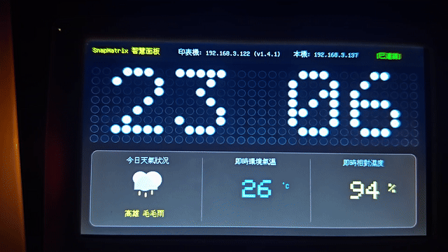
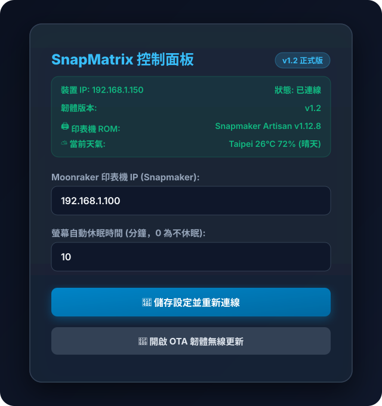

# SnapMatrix-CYD7 🚀

[English](#english) | [繁體中文](#繁體中文)

---

<a name="繁體中文"></a>
## 🇹🇼 繁體中文

### 📖 專案簡介
**SnapMatrix-CYD7** 是一套專為 **Sunton / CYD ESP32-8048S070（7 吋 800x480 RGB 電容觸控螢幕）** 設計的 3D 印表機智慧儀表板與虛擬 LED 矩陣顯示系統。

透過 WebSocket 即時連接 **Moonraker / Klipper**（支援 Snapmaker 及各類 Klipper 3D 印表機），將機器運作狀態、噴頭/熱床溫度、列印進度、剩餘時間、風扇轉速等數據以現代科技感 UI 與像素風 32x8 虛擬 LED 點陣動畫生動呈現。

---

### 🎬 實機運作展示 (Live Demo)

<p align="center">
  
</p>

#### 📺 實機展示影片
- **完整操作與虛擬點陣動態展示 (38 秒)**：  
  https://github.com/ChenChaoYao/SnapMatrix-CYD7/raw/main/docs/VID_20260901_230604.mp4  
  *(備用連結：[點此直接開啟 / 下載 MP4 影片](docs/VID_20260901_230604.mp4))*

- **畫面切換與過渡動態展示 (短片)**：  
  https://github.com/ChenChaoYao/SnapMatrix-CYD7/raw/main/docs/VID_20260901_230657.mp4  
  *(備用連結：[點此直接開啟 / 下載 MP4 影片](docs/VID_20260901_230657.mp4))*

---

### ✨ 核心特色

1. **🎨 32x8 虛擬像素 LED 點陣引擎**
   - 模擬真實點陣 LED 視覺光暈（Glow Halo）、高光反射（Specular Highlight）與熄滅底色。
   - 差異化局部更新（Differential Rendering）技術，極致流暢且零閃爍。
   - 豐富的動態狀態動畫：
     - 🔥 **熱床加溫**：動態熱浪波紋效果
     - 🌡️ **噴頭加熱**：漸層加熱與熔融滴落動畫
     - 📐 **自動調平**：水平感應探針巡檢動態
     - 🌊 **流量校準**：擠出測試動態波浪
     - 🖨️ **列印中**：動態噴頭往復擺動與實體層層堆疊
     - 🎆 **列印完成**：40 顆粒子系統全彩煙火慶祝特效

2. **⚡ 即時 Moonraker / Klipper 遙測連線**
   - 使用輕量化 WebSocket 即時雙向通訊，延遲低於 50ms。
   - 自動解析 G-code 狀態、列印進度百分比、層高、剩餘時間（ETA）、耗材狀態與機器型號/韌體版本。

3. **⛅ 即時天氣與 NTP 數位時鐘**
   - 整合 Open-Meteo API，自動同步所在地即時氣溫、濕度與天氣狀態（晴天、多雲、雨天、打雷、降雪等專屬像素圖示）。
   - 待機與休眠時自動切換為高質感大字體 24 小時制 NTP 時鐘與即時天氣儀表。

4. **👆 GT911 電容式觸控與智慧節能**
   - **單擊觸控**：隨時一鍵在「工作儀表板」與「待機休眠模式」之間切換。
   - **自動休眠**：可自訂閒置時間（預設 10 分鐘）自動進入待機。
   - **智慧調光**：休眠滿 1 分鐘後自動將螢幕背光降至 30%，喚醒時瞬間恢復 100% 亮度。

5. **🌐 現代化 Web 控制台與 ElegantOTA**
   - 支援 **WiFiManager** 熱點配網（熱點名稱：`SnapMatrix-CYD7-Setup`），手機連線即可設定 Wi-Fi 與印表機 IP。
   - 內建 Glassmorphism 毛玻璃質感的 Web 管理介面（Port 80）。
   - 支援 **ElegantOTA** 瀏覽器無線韌體更新（`/update`），無需插線即可空中升級。

### 🖥️ Web 控制面板介面 (Web UI)

裝置連上區域網路後，在瀏覽器輸入裝置的 IP 位址（例如 `http://192.168.1.150`），即可進入深色毛玻璃質感的控制面板：

<p align="center">
  
</p>

- **即時狀態看板**：即時顯示目前裝置 IP、印表機連線狀態、韌體版本、自動辨識之印表機型號與 ROM 版本、當前氣溫與天氣狀況。
- **動態參數設定**：可線上即時變更 Moonraker IP 位址與螢幕自動休眠時間，點擊儲存即可熱套用重新連線。
- **OTA 無線韌體更新**：點擊「開啟 OTA 韌體無線更新」可進入 `/update` 頁面，免插傳輸線即可直接瀏覽器空中升級。

---

### 🛠️ 硬體規格

| 項目 | 規格 |
| :--- | :--- |
| **主控晶片** | ESP32-S3-WROOM-1 (Dual-Core 240MHz) |
| **螢幕規格** | 7.0 吋 800×480 16-bit RGB 介面 LCD |
| **觸控面板** | GT911 I2C 電容式觸控 |
| **記憶體** | 16MB Flash (QIO) + 8MB PSRAM (OPI) |
| **顯示驅動庫** | [LovyanGFX](https://github.com/lovyan03/LovyanGFX) (硬體 RGB DMA 加速) |
| **通訊協議** | WebSocket, HTTP REST, NTP (UDP) |

---

### 🚀 快速開始

#### 1. 安裝環境
- 安裝 [Visual Studio Code](https://code.visualstudio.com/)
- 安裝 [PlatformIO IDE](https://platformio.org/) 延伸模組

#### 2. 下載與編譯
```bash
# 複製專案
git clone https://github.com/ChenChaoYao/SnapMatrix-CYD7.git
cd SnapMatrix-CYD7

# 編譯並燒錄韌體
pio run --target upload

# 開啟 Serial 監控視窗 (115200 baud)
pio device monitor
```

#### 3. 初始配網
1. 開機後若未連接 Wi-Fi，裝置會啟動名為 **`SnapMatrix-CYD7-Setup`** 的 Wi-Fi 熱點。
2. 使用手機或電腦連線至該熱點，瀏覽器將自動彈出設定網頁（或手動開啟 `192.168.4.1`）。
3. 選擇家中 Wi-Fi 並輸入密碼，填入 Moonraker 印表機的 IP 位址後儲存重啟。

#### 4. 網頁管理與 OTA 更新
- 在同一區域網路下的瀏覽器輸入裝置 IP（如 `http://192.168.1.50`）進入控制面板。
- 前往 `http://<裝置IP>/update` 即可上傳 `.bin` 韌體進行無線 OTA 更新。

---

<br>

---

<a name="english"></a>
## 🌐 English

### 📖 Introduction
**SnapMatrix-CYD7** is a smart 3D printer telemetry dashboard and virtual LED matrix display built specifically for the **Sunton / CYD ESP32-8048S070 (7.0" 800x480 RGB LCD with GT911 Capacitive Touch)**.

By connecting directly to **Moonraker / Klipper** (supporting Snapmaker and all standard Klipper-powered 3D printers) via low-latency WebSockets, it visualizes real-time print telemetry, nozzle/bed temperatures, progress, ETA, fan speeds, and dynamic 32x8 pixel-art LED animations on a sleek sci-fi dashboard.

---

### 🎬 Live Demo

<p align="center">
  
</p>

#### 📺 Video Walkthroughs
- **Full Operational & Virtual Matrix Demo (38s)**:  
  https://github.com/ChenChaoYao/SnapMatrix-CYD7/raw/main/docs/VID_20260901_230604.mp4  
  *(Direct link: [Watch / Download MP4](docs/VID_20260901_230604.mp4))*

- **UI Transition & Touch Response Demo**:  
  https://github.com/ChenChaoYao/SnapMatrix-CYD7/raw/main/docs/VID_20260901_230657.mp4  
  *(Direct link: [Watch / Download MP4](docs/VID_20260901_230657.mp4))*

---

### ✨ Key Features

1. **🎨 32x8 Virtual Pixel Art LED Matrix Engine**
   - High-fidelity LED simulation featuring outer glow halos, specular center highlights, and realistic unlit LED wells.
   - Flicker-free differential rendering engine powered by LovyanGFX RGB DMA.
   - Dynamic pixel-art status animations:
     - 🔥 **Bed Heating**: Rising thermal wave simulation
     - 🌡️ **Nozzle Heating**: Thermal gradient & dripping molten filament
     - 📐 **Auto Bed Leveling**: Animated sweeping bed probe
     - 🌊 **Flow Calibration**: Dynamic extruded extrusion wave
     - 🖨️ **Printing**: Real-time oscillating printhead with layer accumulation
     - 🎆 **Print Complete**: 40-particle physics-based full-color firework celebration

2. **⚡ Real-Time Moonraker / Klipper Integration**
   - Sub-50ms latency bidirectional WebSocket communication.
   - Live parsing of print progress, current/target temperatures, layer height, remaining time, filament runout status, and printer ROM/model info.

3. **⛅ Open-Meteo Live Weather & NTP Digital Clock**
   - Synchronizes local weather conditions (temperature, humidity, condition icons for sunny, cloudy, rainy, stormy, snowy).
   - High-contrast 24-hour NTP clock with weather readout during standby/screensaver.

4. **👆 GT911 Capacitive Touch & Smart Power Management**
   - **One-Tap Touch Toggle**: Switch instantly between Active Telemetry Dashboard and Standby Clock.
   - **Auto Standby**: Configurable idle timeout (default: 10 mins).
   - **Auto Dimming**: Automatically steps backlight down to 30% after 1 minute in standby; restores 100% immediately on touch or when a new print starts.

5. **🌐 Modern Web Control Panel & ElegantOTA**
   - **WiFiManager Captive Portal** (`SnapMatrix-CYD7-Setup`) for zero-code initial Wi-Fi & Printer IP configuration.
   - Dark-themed Glassmorphism web management dashboard (Port 80).
   - Integrated **ElegantOTA** wireless firmware update portal (`/update`).

### 🖥️ Web Management Dashboard (Web UI)

Once connected to your local network, navigate to the device's IP address (e.g., `http://192.168.1.150`) in any browser to access the modern Glassmorphism control panel:

<p align="center">
  
</p>

- **Real-time Telemetry Banner**: Live display of device IP, printer connection status, firmware version, printer model/ROM auto-detected via Moonraker, and current Open-Meteo weather.
- **Dynamic Configuration**: Adjust Moonraker IP and screen standby timeout on the fly without reflashing.
- **OTA Firmware Updates**: Direct link to `/update` for seamless over-the-air firmware updates via browser.

---

### 🛠️ Hardware Specifications

| Component | Specification |
| :--- | :--- |
| **MCU** | ESP32-S3-WROOM-1 (Dual-Core 240MHz, Xtensa LX7) |
| **Display** | 7.0-inch 800×480 16-bit RGB Interface LCD |
| **Touch** | GT911 I2C Capacitive Multi-touch |
| **Memory** | 16MB Flash (QIO) + 8MB PSRAM (OPI) |
| **GFX Framework** | [LovyanGFX](https://github.com/lovyan03/LovyanGFX) (RGB DMA accelerated) |
| **Protocols** | WebSocket, HTTP REST, NTP (UDP) |

---

### 🚀 Getting Started

#### 1. Requirements
- [Visual Studio Code](https://code.visualstudio.com/)
- [PlatformIO IDE](https://platformio.org/) Extension

#### 2. Build & Flash
```bash
# Clone the repository
git clone https://github.com/ChenChaoYao/SnapMatrix-CYD7.git
cd SnapMatrix-CYD7

# Build and flash firmware
pio run --target upload

# Open Serial Monitor (115200 baud)
pio device monitor
```

#### 3. Initial Configuration
1. When powered on without saved credentials, the device creates an AP named **`SnapMatrix-CYD7-Setup`**.
2. Connect to the AP from your phone or PC (Captive portal will pop up automatically, or visit `192.168.4.1`).
3. Enter your Wi-Fi credentials and the IP address of your Moonraker printer, then save and reboot.

#### 4. Web Dashboard & OTA Updates
- Access the web portal by navigating to `http://<device-ip>` in your browser.
- Perform over-the-air firmware updates anytime at `http://<device-ip>/update`.

---

### 📜 License
This project is licensed under the MIT License - see the [LICENSE](LICENSE) file for details.
